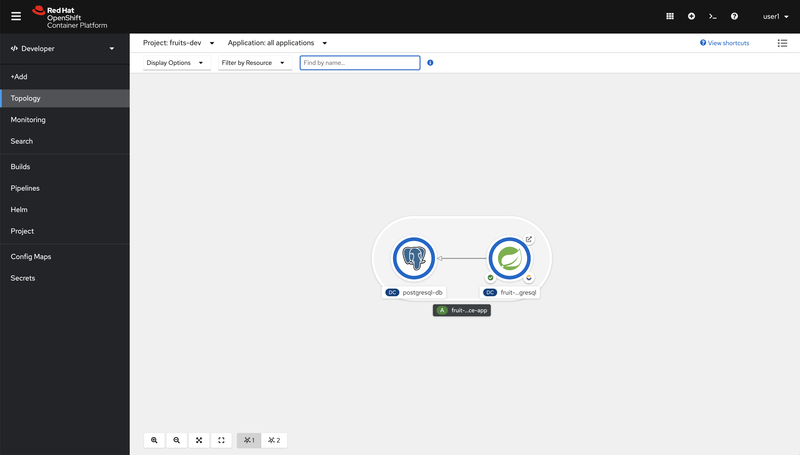

= CRUD - Spring Boot Example Application

This example application will help you to get started with Spring Boot CRUD applications on OpenShift, is based on link:https://github.com/openshift-katacoda/rhoar-getting-started/tree/master/spring/spring-db-access[this] one although I have migrated from Fabric8 to JKube and added Oracle support and a CICD pipeline.

IMPORTANT: This example application requires Java 11 JDK or greater and Maven 3.6.3 or greater.

IMPORTANT: You need access to an OpenShift 4.x cluster, local single-node (CRC) or remote multi-node.

WARNING: Before proceeding log in your cluster using `oc login` with a normal user no need for special permissions.

== Running the example on OpenShift against PotgreSQL

In order to run our application, we need a namespace, let's create one:
[source,bash,options="nowrap",subs="attributes+"]
----
$ export PROJECT_NAME=fruits-postgresql-dev

$ oc new-project $/{PROJECT_NAME}
----

In order for application to work we'll first deploy a PostgreSQL database then our example application, to do so run these commands:
[source,bash,options="nowrap",subs="attributes+"]
----
$ oc new-app -e POSTGRESQL_USER=luke -e POSTGRESQL_PASSWORD=secret -e POSTGRESQL_DATABASE=FRUITSDB \
  centos/postgresql-10-centos7 --as-deployment-config=true --name=postgresql-db -n $/{PROJECT_NAME}

$ oc label dc/postgresql-db app.kubernetes.io/part-of=fruit-service-app -n $/{PROJECT_NAME} && \
  oc label dc/postgresql-db app.openshift.io/runtime=postgresql --overwrite=true -n $/{PROJECT_NAME} 

$ mvn clean oc:deploy -Popenshift-postgresql
----

Move to the OpenShift web console and from `Topology` in the `Developer` perspective click on the route link as in the picture.

You should see this.

== Running the example on OpenShift against Oracle

This time we're going to install Oracle in a different namespace to make it look as an external database.

WARNING: You need credentials in the link:https://container-registry.oracle.com/pls/apex/f?p=113:1:113820723533011:::1:P1_BUSINESS_AREA:3:[Oracle Container Registry] in order to download Oracle DB images.

Please run these commands as cluster-admin to deploy Oracle DB:

NOTE: You may need to delete/adjust Limit Ranges in `${ORACLE_DB_PROJECT_NAME}` project because the deployment object will request 4Gi.

NOTE: The OCI image to be downloaded is quite big, to grab a cup of coffee and keep calm.

[source,bash,options="nowrap",subs="attributes+"]
----
# Create a project to deploy Oracle DB
$ export ORACLE_DB_PROJECT_NAME=oracle-db-prj
$ oc new-project ${ORACLE_DB_PROJECT_NAME}

# Adjust permissions
$ oc adm policy add-scc-to-user privileged -z default -n ${ORACLE_DB_PROJECT_NAME} && \
  oc adm policy add-scc-to-user anyuid -z default -n ${ORACLE_DB_PROJECT_NAME}

# Type in your user/email in the Oracle Container Regisry
$ echo -n "Reg. Email: " && read email

# Read Password
$ echo -n "Reg. Password: " && read -s password

# Create a pull secret for the Oracle Container Registry
$ oc create secret docker-registry oracle-registry \
    --docker-server=container-registry.oracle.com \
    --docker-username=${email} \
    --docker-password=${password} \
    --docker-email=${email} -n ${ORACLE_DB_PROJECT_NAME}

# Deploy Oracle DB
$ oc apply -f ./k8s/oracle-db.yaml
----

NOTE: Once the container is running again be calm, after starting the DB daemon data needs to be copied. In total it could take more than 10 mins.

To have a look to the logs do this.
[source,bash,options="nowrap",subs="attributes+"]
----
$ oc project ${ORACLE_DB_PROJECT_NAME}
$ oc logs -f $(oc get pods -o json | jq -r '.items[] | select(.metadata.name | test("oracle-db")).metadata.name')
----

If you see this you're on your way to get it working.
[source,bash,options="nowrap",subs="attributes+"]
----
[2021:01:25 16:50:34]: Acquiring lock on /opt/oracle/oradata/.ORCL.create_lck
[2021:01:25 16:50:34]: Lock acquired on /opt/oracle/oradata/.ORCL.create_lck
[2021:01:25 16:50:34]: Holding on to the lock using /tmp/.ORCL.create_lck
ORACLE EDITION: ENTERPRISE
ORACLE PASSWORD FOR SYS, SYSTEM AND PDBADMIN: ******

LSNRCTL for Linux: Version 19.0.0.0.0 - Production on 25-JAN-2021 16:50:34

Copyright (c) 1991, 2019, Oracle.  All rights reserved.

Starting /opt/oracle/product/19c/dbhome_1/bin/tnslsnr: please wait...

TNSLSNR for Linux: Version 19.0.0.0.0 - Production
System parameter file is /opt/oracle/product/19c/dbhome_1/network/admin/listener.ora
Log messages written to /opt/oracle/diag/tnslsnr/oracle-db-5999c5bd66-x9t9h/listener/alert/log.xml
Listening on: (DESCRIPTION=(ADDRESS=(PROTOCOL=ipc)(KEY=EXTPROC1)))
Listening on: (DESCRIPTION=(ADDRESS=(PROTOCOL=tcp)(HOST=0.0.0.0)(PORT=1521)))

Connecting to (DESCRIPTION=(ADDRESS=(PROTOCOL=IPC)(KEY=EXTPROC1)))
STATUS of the LISTENER
------------------------
Alias                     LISTENER
Version                   TNSLSNR for Linux: Version 19.0.0.0.0 - Production
Start Date                25-JAN-2021 16:50:34
Uptime                    0 days 0 hr. 0 min. 0 sec
Trace Level               off
Security                  ON: Local OS Authentication
SNMP                      OFF
Listener Parameter File   /opt/oracle/product/19c/dbhome_1/network/admin/listener.ora
Listener Log File         /opt/oracle/diag/tnslsnr/oracle-db-5999c5bd66-x9t9h/listener/alert/log.xml
Listening Endpoints Summary...
  (DESCRIPTION=(ADDRESS=(PROTOCOL=ipc)(KEY=EXTPROC1)))
  (DESCRIPTION=(ADDRESS=(PROTOCOL=tcp)(HOST=0.0.0.0)(PORT=1521)))
The listener supports no services
The command completed successfully
Prepare for db operation
8% complete
Copying database files
31% complete
Creating and starting Oracle instance
32% complete
36% complete
40% complete
43% complete
46% complete
Completing Database Creation
----

Now wait until the database has been initialized, you should see this.

[source,bash,options="nowrap",subs="attributes+"]
----
...

The Oracle base remains unchanged with value /opt/oracle
#########################
DATABASE IS READY TO USE!
#########################

Executing user defined scripts
/opt/oracle/runUserScripts.sh: ignoring /opt/oracle/scripts/startup/lost+found

DONE: Executing user defined scripts

The following output is now a tail of the alert.log:
ORCLPDB1(3):
ORCLPDB1(3):XDB initialized.
2021-01-25T17:05:21.301744+00:00
ALTER SYSTEM SET control_files='/opt/oracle/oradata/ORCL/control01.ctl' SCOPE=SPFILE;
2021-01-25T17:05:21.307239+00:00
ALTER SYSTEM SET local_listener='' SCOPE=BOTH;
   ALTER PLUGGABLE DATABASE ORCLPDB1 SAVE STATE
Completed:    ALTER PLUGGABLE DATABASE ORCLPDB1 SAVE STATE

XDB initialized.
----

So the database has been initialized, now we have to create a user in PDB `ORCLPDB1`.

Let's connect to the container and run some commands in order to create the user/schema to hold our data in PDB `ORCLPDB1`:
[source,bash,options="nowrap",subs="attributes+"]
----
$ oc project ${ORACLE_DB_PROJECT_NAME}
$ oc rsh $(oc get pods -o json | jq -r '.items[] | select(.metadata.name | test("oracle-db")).metadata.name')
sh-4.2$ 
----

Now that you're connected to the container run this command
[source,bash,options="nowrap",subs="attributes+"]
----
$ sqlplus system/Kube#2020@localhost:1521/${ORACLE_PDB}

SQL*Plus: Release 19.0.0.0.0 - Production on Mon Jan 25 17:10:36 2021
Version 19.3.0.0.0

Copyright (c) 1982, 2019, Oracle.  All rights reserved.

Connected to:
Oracle Database 19c Enterprise Edition Release 19.0.0.0.0 - Production
Version 19.3.0.0.0

SQL> 
----

Then this SQL statements in `sqlplus`:

[source,bash,options="nowrap",subs="attributes+"]
----
SQL> create user luke identified by "secret";

User created.

SQL> grant CREATE SESSION, ALTER SESSION, CREATE DATABASE LINK, -
  CREATE MATERIALIZED VIEW, CREATE PROCEDURE, CREATE PUBLIC SYNONYM, -
  CREATE ROLE, CREATE SEQUENCE, CREATE SYNONYM, CREATE TABLE, - 
  CREATE TRIGGER, CREATE TYPE, CREATE VIEW, UNLIMITED TABLESPACE -
  to luke;

Grant succeeded.
----

Nice! You're Oracle DB is up and running and initialized, you can exit `sqplplus` and the container.

Now resume as a normal user, no need to be `cluster-admin` anymore. Log in again with the normal user if necessary!

In order to run our application, we need a namespace, let's create one:
[source,bash,options="nowrap",subs="attributes+"]
----
$ export PROJECT_NAME=fruits-oracle-dev

$ oc new-project $/{PROJECT_NAME}
----

We want to connect to the Oracle DB as if it were external, so let'd create a Service using a external name:

[source,bash,options="nowrap",subs="attributes+"]
----
cat <<EOF | oc apply -n $/{PROJECT_NAME} -f -
apiVersion: v1
kind: Service
metadata:
  name: oracle-db
spec:
  type: ExternalName
  externalName: oracle-db.oracle-db-prj.svc.cluster.local
EOF
----

NOTE: This is not the only way, you could create a service with no selector and point to an external but reacheable IP address, as in this example. We cannot use this apporach because the IP of our Oracle DB is internal and this is not allowed. Here you are an example.

[source,yaml,options="nowrap",subs="attributes+"]
----
kind: Service
apiVersion: v1
metadata:
 name: oracle-db
spec:
 type: ClusterIP
 ports:
 - port: 1521
   targetPort: 1521
---
kind: Endpoints
apiVersion: v1
metadata:
 name: oracle-db
subsets:
 - addresses:
     - ip: ${ORACLE_DB_SVC_IP}
   ports:
     - port: 1521
EOF
----

Ok, time to deploy our oracle-flavoured application, please execute these commands:
[source,bash,options="nowrap",subs="attributes+"]
----
$ oc project $\/{PROJECT_NAME}

$ mvn clean oc:deploy -Popenshift-oracle
----

Move to the OpenShift web console and from `Topology` in the `Developer` perspective click on the route link as in the picture.

You should see this.

## Development Innerloop Reloaded

oc port-foward...

SERVICE_DB_USER=luke SERVICE_DB_PASSWORD=secret SERVICE_DB_NAME=my_data SERVICE_DB_HOST=localhost \
  mvn clean spring-boot:run -Dspring-boot.run.profiles=openshift-orcl -Popenshift-orcl

# PostgreSQL

oc port-foward...

SERVICE_DB_USER=luke SERVICE_DB_PASSWORD=secret SERVICE_DB_NAME=my_data SERVICE_DB_HOST=localhost \
  mvn clean spring-boot:run -Dspring-boot.run.profiles=openshift-postgresql -Popenshift-postgresql

mvn clean package -Popenshift-postgresql
SERVICE_DB_USER=luke SERVICE_DB_PASSWORD=secret SERVICE_DB_NAME=my_data SERVICE_DB_HOST=localhost \
  java -jar ./target/fruit-service-dev-1.0.0.jar -Dspring-boot.run.profiles=openshift-postgresql

